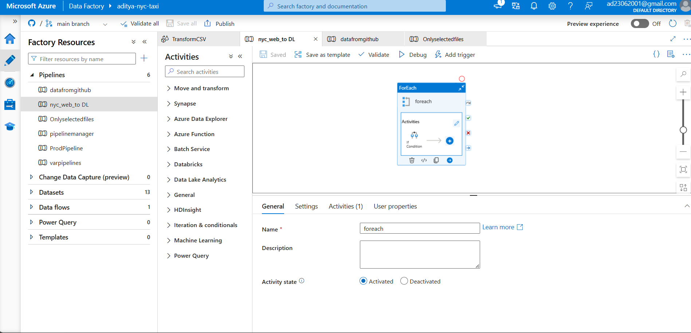

# NYC Taxi Data Engineering Project

## Overview
This project implements an end-to-end data engineering solution for processing NYC Taxi trip data using Azure Data Factory, Databricks, and PySpark. The pipeline automatically fetches data from the NYC Taxi & Limousine Commission website, processes it through various transformation stages, and stores it in a structured format for analysis.

## Architecture


### Components:
- **Data Ingestion**: Azure Data Factory pipelines with dynamic parameters
- **Processing**: Azure Databricks with PySpark
- **Storage**: Azure Data Lake Storage Gen2
- **Orchestration**: Azure Data Factory pipeline management

## Key Features
- Dynamic data ingestion from NYC TLC website
- Parameterized pipelines for flexible execution
- Medallion architecture implementation (Bronze → Silver → Gold)
- Automated data quality checks
- Incremental data loading capability
- Error handling and monitoring

## Pipeline Structure
1. **Bronze Layer**
   - Raw data ingestion
   - Schema validation
   - Initial data landing

2. **Silver Layer**
   - Data cleaning
   - Type casting
   - Standardization
   - Basic transformations

3. **Gold Layer**
   - Business logic implementation
   - Aggregations
   - Final data models

## Setup Instructions
1. Clone the repository
2. Configure Azure services:
   - Set up Azure Data Factory
   - Create Azure Databricks workspace
   - Configure Azure Data Lake Storage

3. Environment Setup:
```bash
# Configure Azure credentials
az login

# Set up variables in Azure Data Factory
# Follow the parameter setup guide in /docs
```

## Pipeline Variables
- `DataSource`: Source URL configuration
- `FilePath`: Dynamic file path generation
- `ProcessingDate`: Date parameter for incremental loads
- `Environment`: Development/Production switch

## Execution
1. **Manual Execution**:
   - Navigate to Azure Data Factory
   - Select the main pipeline
   - Click "Trigger Now"

2. **Scheduled Execution**:
   - Configure trigger in ADF
   - Set schedule parameters
   - Enable monitoring

## Data Transformations
Major transformations include:
- Date/time standardization
- Geospatial data processing
- Fare calculation validation
- Trip duration computations

## Monitoring and Maintenance
- Pipeline execution logs in Azure Monitor
- Custom alerting setup
- Error handling framework
- Performance metrics tracking

## Future Enhancements
- Real-time data processing implementation
- Advanced analytics integration
- Machine learning model integration
- Dashboard development

## Contributing
1. Fork the repository
2. Create feature branch
3. Submit pull request with detailed description

## Contact
For questions or feedback, please contact:
- Email: aditya.pandey.ug21@nsut.ac.in
- LinkedIn: [Aditya Pandey](https://www.linkedin.com/in/aditya-pandey-98562522a/)

## License
This project is licensed under the MIT License - see the LICENSE file for details.
